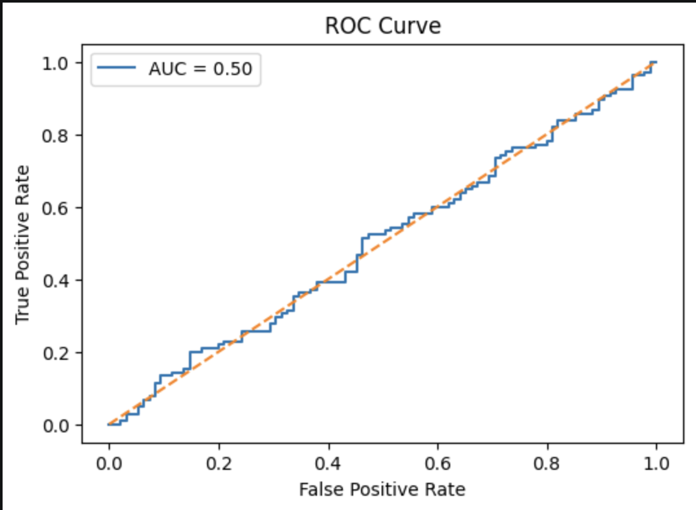
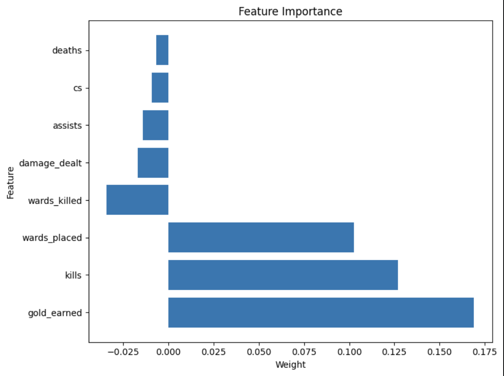

# 🎮 League of Legends Match Outcome Prediction

Predicting League of Legends match outcomes using machine learning and in-game performance metrics.

---

## 📖 Project Overview

League of Legends is one of the world's most popular esports titles, generating millions of matches and vast amounts of gameplay data. Understanding which factors contribute to victory can provide valuable insights for players, analysts, and teams.

This project explores whether gameplay statistics can accurately predict match outcomes. Using Logistic Regression implemented in PyTorch, a binary classification model was developed to classify matches as either wins or losses based on player and team performance metrics.

---

## 🎯 Objectives

The primary goals of this project were to:

* Analyze League of Legends match data.
* Identify gameplay features that influence match outcomes.
* Build a binary classification model to predict winners.
* Evaluate model performance using multiple metrics.
* Interpret feature importance to understand key predictors.

---

## 📊 Dataset

The dataset contains match-level statistics collected from League of Legends games.

### Features Included

Examples of attributes used for prediction:

* Gold Earned
* Kills
* Deaths
* Assists
* Damage Dealt
* Vision Control Metrics
* Team Performance Statistics

### Target Variable

* **Win = 1**
* **Loss = 0**

---

## ⚙️ Methodology

### Data Preprocessing

Before training the model:

* Missing values were handled.
* Relevant features were selected.
* Data was standardized using feature scaling.
* The dataset was split into training and testing sets.

### Model Development

A Logistic Regression classifier was implemented using PyTorch.

Key components include:

* Linear Layer
* Sigmoid Activation Function
* Binary Cross Entropy Loss
* Gradient Descent Optimization

### Regularization

L2 Regularization was applied to reduce overfitting and improve model generalization.

### Hyperparameter Tuning

Different learning rates and training configurations were explored to optimize predictive performance.

---

## 📈 Model Evaluation

The model was evaluated using:

* Accuracy Score
* Confusion Matrix
* Classification Report
* ROC Curve
* Area Under the Curve (AUC)

These metrics provide a comprehensive understanding of classification performance and predictive capability.

---

## 📊 Results

### ROC-AUC Analysis



The ROC curve demonstrates the model's ability to distinguish between winning and losing teams across multiple classification thresholds.

### Feature Importance



Feature importance analysis highlights the gameplay metrics that contribute most strongly to match outcomes.

### Key Findings

* Gold earned emerged as one of the strongest predictors of victory.
* Higher kill counts were strongly associated with winning outcomes.
* Vision control metrics contributed positively to match performance.
* Logistic Regression achieved meaningful predictive performance despite its relatively simple architecture.

---

## 🛠️ Technologies Used

| Tool             | Purpose                    |
| ---------------- | -------------------------- |
| Python           | Programming Language       |
| PyTorch          | Model Development          |
| Pandas           | Data Manipulation          |
| Scikit-Learn     | Evaluation & Preprocessing |
| Matplotlib       | Data Visualization         |
| Jupyter Notebook | Development Environment    |

---

## 📁 Project Structure

```text
League-of-Legends-Match-Predictor/
│
├── README.md
├── requirements.txt
├── league-of-legends-match-predictor.ipynb
│
├── images/
│   ├── roc_auc.png
│   └── feature_importance.png
│
└── saved_model.pth
```

---

## 💡 Key Learnings

Through this project, I gained practical experience with:

* Binary Classification Problems
* Machine Learning Workflows
* Data Preprocessing Techniques
* Model Evaluation Strategies
* Hyperparameter Optimization
* Feature Interpretation and Analysis

---

## 🚀 Future Improvements

Potential enhancements include:

* Comparing performance with Random Forest and XGBoost models.
* Incorporating additional gameplay statistics.
* Building an interactive prediction dashboard.
* Exploring advanced feature engineering techniques.

---

## 👨‍💻 Author

**Samridhi Bhardwaj**

Originally developed as part of a Machine Learning course project and later refined for portfolio presentation.
